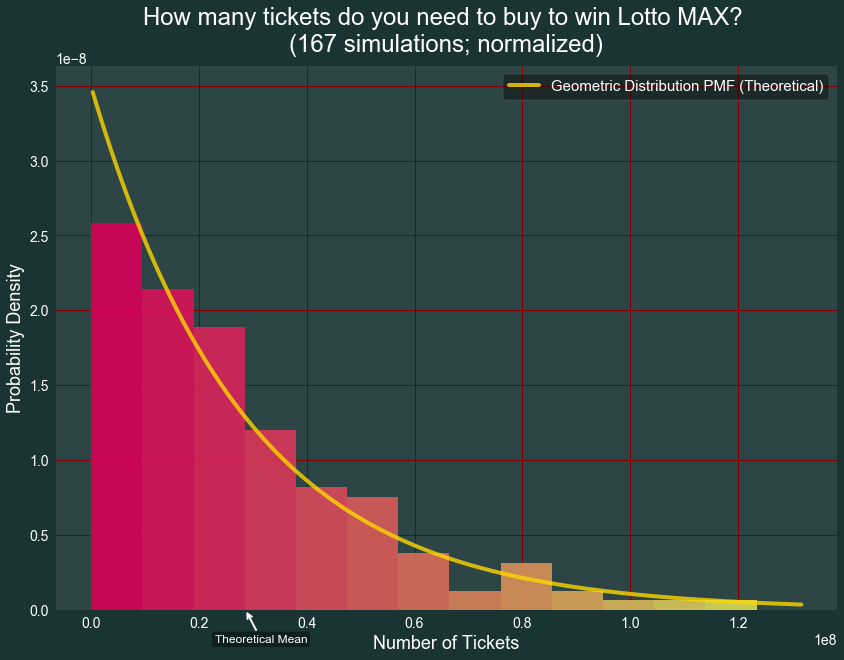
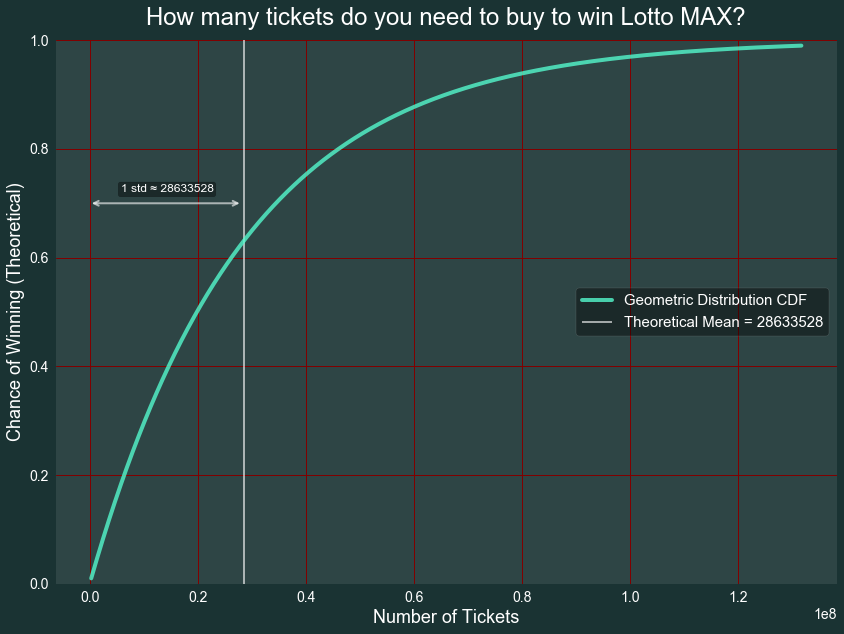
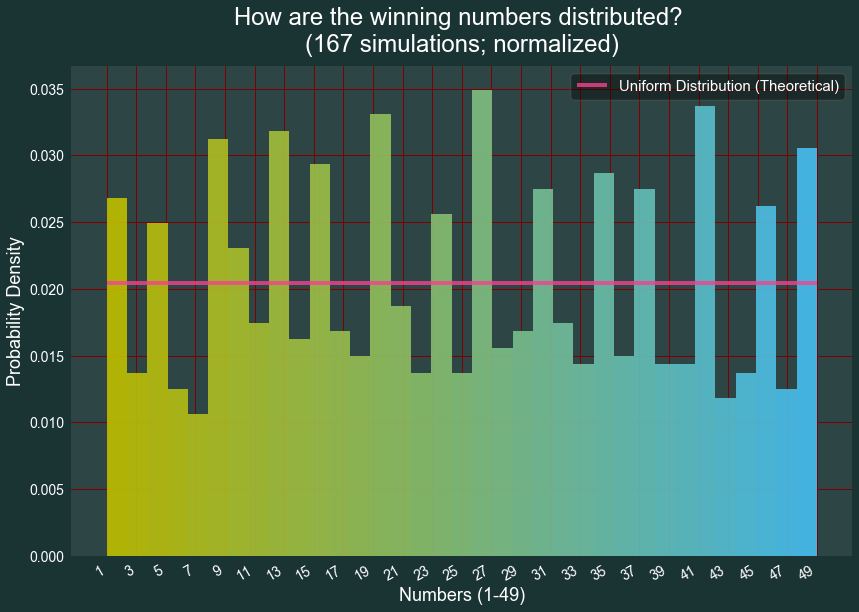

```python
import numpy as np
import pandas as pd
import math, random
from scipy.special import comb
import scipy.stats

import matplotlib
import matplotlib.pyplot as plt
%matplotlib inline
import seaborn as sns
sns.set(style="darkgrid")
def UseAwesomeStyle(style, update_rcParams=True): #https://matplotlib.org/users/customizing.html
    style=style.lower()
    if style == "darkgreen":
        params = {"ytick.color" : "w",
                  "xtick.color" : "w",
                  "axes.labelcolor" : "w",
                  "axes.edgecolor" : "w",
                  "text.color" : "w",
                  "grid.color" : (0.5,0,0,0.2),
                  "figure.facecolor" : (0.1,0.2,0.2),
                  "axes.facecolor" : (0.9,0.9,0.9,0.1),
                  "savefig.facecolor" : (0.1,0.2,0.2),
                  "axes.titlepad" : 15,
                  "legend.frameon": True,
                  "legend.facecolor": (0,0,0,0.4),
                  "legend.framealpha": 0.4,
                  "legend.fontsize": 15,
                  "axes.titlesize": 24,
                  "axes.labelsize": 18,
                  "xtick.labelsize" : 14,
                  "ytick.labelsize" : 14,
                 }
    elif style == "dark":
        params = UseAwesomeStyle("darkgreen")
        params["figure.facecolor"] = "#1E1E1E"
        params["savefig.facecolor"] = "#1E1E1E"
    if update_rcParams == True:
        plt.rcParams.update(params)
    return params
UseAwesomeStyle("DarkGreen")

def grouped_barplot(df, cat, subcat, val, err=None, err_colour=(0,0,0,0.5), save=None, dpi=300, debug=False):
    error_bar = False
    error_bar_name = err
    if type(err) == str:
        error_bar = True
    u = df[cat].unique()
    x = np.arange(len(u))
    subx = df[subcat].unique()
    offsets = (np.arange(len(subx))-np.arange(len(subx)).mean())/(len(subx)+1.)
    width= np.diff(offsets).mean()
    for i, gr in enumerate(subx):
        dfg = df[df[subcat]==gr]
        if debug==True:
            print("Group", dfg)
        if error_bar == True:
            err = dfg[error_bar_name].values
            if debug == True:
                print(err)
        ax = plt.bar(x+offsets[i], dfg[val].values, width=width,
                label="{} {}".format(subcat, gr), yerr=err, ecolor=err_colour)
    plt.xlabel(cat)
    plt.ylabel(val)
    plt.xticks(x, u)
    plt.legend()
    plt.tight_layout()
    try:
        plt.gcf().savefig(save, dpi=dpi)
    except: pass
    #plt.show()
    return ax
```

Bonus(3 points).  Take frequency distribution of your choice. For example, distribution of mean difference generated in mosquito assignment can be used. Try to find probability distribution function that best describe the distribution. Present probability distribution function (pdf) and cumulative distribution function (cdf) graphically. (Note: you can try probability distribution functions from 'scipy.stats' Python library).

# Behold!!!!
# Lotto MAX (IQ Tax) Simulator Pro™


Objective: to find the statistical distribution of tickets needed to win a lottery (the grand prize)

Official information:

https://www.playolg.ca/content/olg/en/lottery/lotto-max.html


Expectance:

    

Rules:
https://www.playolg.ca/content/dam/olg/documents/2017/11/MAX_GameConditions_EN.pdf


How to win the grand prize:
1. Buy a $5 ticket and choose three sequences, each with 7 numbers ranging from 1 to 49 (without resampling)
2. If any of the three sequences match the supposedly randomly generated 7-number target, you win (order doesn't matter because all sequences are sorted in an ascending fashion)


> $P(winning)=3\cdot \frac{7!}{49\times 48\times 47\times 46\times 45\times 44\times 43}=\frac{1}{28633528}$


```python
eon = comb(49,7)/3
p=1/eon
print("P(winning) = 3*1/C(49,7) = 1/%.0f"%eon)
```

    P(winning) = 3*1/C(49,7) = 1/28633528
    

#### Hypothesis: The number of tickets bought in a row to win follows Geometric Distribution


```python
print("Geometric disctribution (in theory): μ = 1/P =",eon)
print("Geometric disctribution (in theory): σ = √((1-p)/p²) =",((1-p)/p**2)**0.5)
```

    Geometric disctribution (in theory): μ = 1/P = 28633528.0
    Geometric disctribution (in theory): σ = √((1-p)/p²) = 28633527.499999996
    

Simulation 1: just buy tickets with 3 random sequences every time, and hope one of them will match the random target.

Preliminary tests:

I foresee some significant technical challenges (mainly about computing efficiency), so I need to make sure this is doable first. 

http://zwmiller.com/blogs/python_data_structure_speed.html
https://wiki.python.org/moin/PythonSpeed/PerformanceTips


```python
l = np.arange(1,50)
a=[23,45,17,12,56,38,12]
b,c,d=[12,56,38,23,45,17,12],[23,45,12,56,38,12,17],[23,45,17,12,56,38,12]
```


```python
%%timeit
a.sort()
a
```

    217 ns ± 1.29 ns per loop (mean ± std. dev. of 7 runs, 1000000 loops each)
    


```python
%%timeit
a in [b,c,d]
```

    187 ns ± 1.24 ns per loop (mean ± std. dev. of 7 runs, 10000000 loops each)
    


```python
%%timeit
a in (b, c, d)
```

    163 ns ± 1.76 ns per loop (mean ± std. dev. of 7 runs, 10000000 loops each)
    


```python
%%timeit
a == b or a==c or a==d
```

    156 ns ± 0.367 ns per loop (mean ± std. dev. of 7 runs, 10000000 loops each)
    


```python
%%timeit
x1 = np.random.choice(l, 7, replace=False)
x2 = np.random.choice(l, 7, replace=False)
x3 = np.random.choice(l, 7, replace=False)
y = np.random.choice(l, 7, replace=False)
```

    79.5 µs ± 607 ns per loop (mean ± std. dev. of 7 runs, 10000 loops each)
    


```python
%%timeit 
random.randint(1,49)
```

    1.23 µs ± 4.93 ns per loop (mean ± std. dev. of 7 runs, 1000000 loops each)
    


```python
%%timeit
x1=random.sample(range(1, 50), 7)
x2=random.sample(range(1, 50), 7)
x3=random.sample(range(1, 50), 7)
y=random.sample(range(1, 50), 7)
```

    35.8 µs ± 121 ns per loop (mean ± std. dev. of 7 runs, 10000 loops each)
    


```python
%%timeit
x1=random.sample(range(1, 50), 7)
x2=random.sample(range(1, 50), 7)
x3=random.sample(range(1, 50), 7)
y=random.sample(range(1, 50), 7)
if y == x1 or y == x2 or y == x3:
    print("aha")
```

    36.1 µs ± 567 ns per loop (mean ± std. dev. of 7 runs, 10000 loops each)
    


```python
36.1E-6*eon
```


    1033.6703608


Yep! This simulation is really computationally heavy!!! But it should still be doable in finite time. I'll have to use some hack (multi-boxing) to hopefully just collect a few valid data points...

(See the py files for the actual simulation codes)


Even with ~23000 tickets simulated per second, the chance of winning the lottery seems ridiculously slim! This is where one can truly feel the immensity of 28,633,528 (and the black hole of IQ tax)!


But just like in real life, there're some incredibly lucky guys!


Parallel computing can greatly improve the overall data collection speed, although every single process will have dropped performance.


I found running 6 simulators at the same time is probably better than 9, since the drop in individual performance is not too much and the CPU will not be fried (I hope)....


After a day of running, the parallel computing is done (and my PC isn't smoking)!


Now I can put all my simulation results together.


```python
import os
pickle_folder = os.getcwd()+"\\Project Lotto MAX\\pickle\\df\\"
pickle_names = []
for root, dirs, files in os.walk(pickle_folder):
    pickle_names = [name for name in files if "LottoMAX_df" in name] #filter out the wanted files
df_list = [pd.read_pickle(pickle_folder+name) for name in pickle_names]
df = pd.concat(df_list)
df = df[df["won"]>0] #keep only the finished simulations (not winning = unfinished)
df
```


<div>
<style scoped>
    .dataframe tbody tr th:only-of-type {
        vertical-align: middle;
    }

    .dataframe tbody tr th {
        vertical-align: top;
    }

    .dataframe thead th {
        text-align: right;
    }
</style>
<table border="1" class="dataframe">
  <thead>
    <tr style="text-align: right;">
      <th></th>
      <th>won</th>
      <th>numbers</th>
      <th>tickets_count</th>
    </tr>
    <tr>
      <th>gambler ID</th>
      <th></th>
      <th></th>
      <th></th>
    </tr>
  </thead>
  <tbody>
    <tr>
      <th>2018-06-07 06:06:31.479087</th>
      <td>1</td>
      <td>[1, 4, 14, 28, 30, 32, 47]</td>
      <td>7018908</td>
    </tr>
    <tr>
      <th>2018-06-07 06:06:52.614967</th>
      <td>1</td>
      <td>[5, 12, 13, 18, 20, 35, 43]</td>
      <td>16695144</td>
    </tr>
    <tr>
      <th>2018-06-07 06:27:56.556185</th>
      <td>1</td>
      <td>[9, 10, 15, 25, 29, 38, 42]</td>
      <td>33793844</td>
    </tr>
    <tr>
      <th>2018-06-07 07:02:46.455574</th>
      <td>1</td>
      <td>[7, 10, 30, 32, 36, 44, 47]</td>
      <td>8150757</td>
    </tr>
    <tr>
      <th>2018-06-07 07:11:58.713924</th>
      <td>1</td>
      <td>[2, 7, 14, 15, 20, 46, 49]</td>
      <td>22320876</td>
    </tr>
    <tr>
      <th>2018-06-07 07:37:06.934246</th>
      <td>1</td>
      <td>[1, 15, 17, 20, 23, 28, 31]</td>
      <td>32957297</td>
    </tr>
    <tr>
      <th>2018-06-07 08:14:13.851543</th>
      <td>1</td>
      <td>[4, 12, 24, 32, 40, 43, 49]</td>
      <td>51386160</td>
    </tr>
    <tr>
      <th>2018-06-07 09:12:04.741708</th>
      <td>1</td>
      <td>[2, 19, 23, 26, 37, 38, 39]</td>
      <td>41508879</td>
    </tr>
    <tr>
      <th>2018-06-07 09:58:59.436253</th>
      <td>1</td>
      <td>[11, 18, 23, 29, 33, 38, 46]</td>
      <td>46837131</td>
    </tr>
    <tr>
      <th>2018-06-07 10:51:32.469849</th>
      <td>1</td>
      <td>[9, 15, 17, 22, 27, 35, 47]</td>
      <td>19549300</td>
    </tr>
    <tr>
      <th>2018-06-07 11:13:26.791337</th>
      <td>1</td>
      <td>[9, 11, 18, 34, 39, 40, 44]</td>
      <td>12960970</td>
    </tr>
    <tr>
      <th>2018-06-07 11:28:00.387604</th>
      <td>1</td>
      <td>[9, 13, 22, 33, 38, 47, 49]</td>
      <td>40790608</td>
    </tr>
    <tr>
      <th>2018-06-07 12:13:46.403723</th>
      <td>1</td>
      <td>[2, 10, 26, 29, 30, 44, 48]</td>
      <td>8602555</td>
    </tr>
    <tr>
      <th>2018-06-07 12:23:26.898487</th>
      <td>1</td>
      <td>[5, 8, 12, 20, 36, 42, 44]</td>
      <td>16430174</td>
    </tr>
    <tr>
      <th>2018-06-07 12:41:55.046302</th>
      <td>1</td>
      <td>[5, 10, 20, 21, 26, 44, 45]</td>
      <td>18095214</td>
    </tr>
    <tr>
      <th>2018-06-07 13:02:13.272997</th>
      <td>1</td>
      <td>[13, 16, 30, 32, 34, 36, 40]</td>
      <td>48424147</td>
    </tr>
    <tr>
      <th>2018-06-07 13:56:33.902576</th>
      <td>1</td>
      <td>[3, 12, 25, 26, 28, 40, 46]</td>
      <td>7598187</td>
    </tr>
    <tr>
      <th>2018-06-07 14:05:06.986660</th>
      <td>1</td>
      <td>[2, 6, 12, 27, 34, 37, 49]</td>
      <td>80256903</td>
    </tr>
    <tr>
      <th>2018-06-07 15:34:59.318385</th>
      <td>1</td>
      <td>[6, 12, 19, 21, 31, 33, 42]</td>
      <td>8229213</td>
    </tr>
    <tr>
      <th>2018-06-07 15:44:10.301787</th>
      <td>1</td>
      <td>[1, 25, 36, 42, 43, 46, 48]</td>
      <td>45948635</td>
    </tr>
    <tr>
      <th>2018-06-07 16:36:34.948683</th>
      <td>1</td>
      <td>[5, 18, 21, 26, 28, 40, 42]</td>
      <td>8428</td>
    </tr>
    <tr>
      <th>2018-06-07 16:36:35.495594</th>
      <td>1</td>
      <td>[3, 20, 22, 24, 31, 35, 42]</td>
      <td>52080471</td>
    </tr>
    <tr>
      <th>2018-06-07 17:33:44.470107</th>
      <td>1</td>
      <td>[4, 10, 14, 28, 36, 43, 47]</td>
      <td>44852310</td>
    </tr>
    <tr>
      <th>2018-06-07 18:22:56.974049</th>
      <td>1</td>
      <td>[1, 5, 8, 13, 17, 35, 47]</td>
      <td>27033513</td>
    </tr>
    <tr>
      <th>2018-06-07 18:52:36.595950</th>
      <td>1</td>
      <td>[9, 14, 19, 27, 29, 30, 37]</td>
      <td>61176962</td>
    </tr>
    <tr>
      <th>2018-06-07 06:30:03.749856</th>
      <td>1</td>
      <td>[12, 18, 30, 35, 37, 43, 45]</td>
      <td>5281420</td>
    </tr>
    <tr>
      <th>2018-06-07 06:34:42.921263</th>
      <td>1</td>
      <td>[10, 12, 13, 16, 19, 26, 49]</td>
      <td>89134320</td>
    </tr>
    <tr>
      <th>2018-06-07 08:13:22.943494</th>
      <td>1</td>
      <td>[1, 6, 15, 28, 33, 40, 43]</td>
      <td>5173705</td>
    </tr>
    <tr>
      <th>2018-06-07 08:19:07.774541</th>
      <td>1</td>
      <td>[4, 13, 14, 24, 26, 33, 37]</td>
      <td>37556268</td>
    </tr>
    <tr>
      <th>2018-06-07 09:01:04.907622</th>
      <td>1</td>
      <td>[10, 14, 25, 35, 40, 41, 47]</td>
      <td>79005530</td>
    </tr>
    <tr>
      <th>...</th>
      <td>...</td>
      <td>...</td>
      <td>...</td>
    </tr>
    <tr>
      <th>2018-06-07 10:11:36.140920</th>
      <td>1</td>
      <td>[9, 15, 27, 29, 35, 42, 46]</td>
      <td>13075662</td>
    </tr>
    <tr>
      <th>2018-06-07 10:26:08.156787</th>
      <td>1</td>
      <td>[25, 26, 30, 33, 43, 46, 49]</td>
      <td>33911780</td>
    </tr>
    <tr>
      <th>2018-06-07 11:03:37.151372</th>
      <td>1</td>
      <td>[11, 14, 24, 26, 32, 43, 47]</td>
      <td>20050349</td>
    </tr>
    <tr>
      <th>2018-06-07 11:25:48.660563</th>
      <td>1</td>
      <td>[11, 14, 18, 21, 27, 30, 42]</td>
      <td>19899210</td>
    </tr>
    <tr>
      <th>2018-06-07 11:47:50.583504</th>
      <td>1</td>
      <td>[13, 14, 16, 20, 37, 44, 45]</td>
      <td>11073210</td>
    </tr>
    <tr>
      <th>2018-06-07 12:00:05.094893</th>
      <td>1</td>
      <td>[1, 3, 7, 16, 17, 27, 47]</td>
      <td>17840765</td>
    </tr>
    <tr>
      <th>2018-06-07 12:19:45.118060</th>
      <td>1</td>
      <td>[8, 10, 14, 17, 19, 29, 40]</td>
      <td>409594</td>
    </tr>
    <tr>
      <th>2018-06-07 12:20:12.448778</th>
      <td>1</td>
      <td>[7, 10, 26, 30, 34, 41, 42]</td>
      <td>2330435</td>
    </tr>
    <tr>
      <th>2018-06-07 12:22:46.143451</th>
      <td>1</td>
      <td>[1, 2, 19, 21, 26, 31, 32]</td>
      <td>13051352</td>
    </tr>
    <tr>
      <th>2018-06-07 12:37:10.676800</th>
      <td>1</td>
      <td>[4, 10, 12, 16, 18, 42, 48]</td>
      <td>11644488</td>
    </tr>
    <tr>
      <th>2018-06-07 12:50:02.093708</th>
      <td>1</td>
      <td>[10, 18, 21, 23, 27, 38, 41]</td>
      <td>45639439</td>
    </tr>
    <tr>
      <th>2018-06-07 13:40:30.313198</th>
      <td>1</td>
      <td>[1, 8, 11, 20, 31, 39, 45]</td>
      <td>13707133</td>
    </tr>
    <tr>
      <th>2018-06-07 13:55:40.337695</th>
      <td>1</td>
      <td>[10, 13, 21, 29, 31, 39, 41]</td>
      <td>45706426</td>
    </tr>
    <tr>
      <th>2018-06-07 14:46:12.882442</th>
      <td>1</td>
      <td>[6, 14, 16, 29, 30, 37, 42]</td>
      <td>42107669</td>
    </tr>
    <tr>
      <th>2018-06-07 15:33:04.199475</th>
      <td>1</td>
      <td>[8, 23, 24, 25, 28, 35, 36]</td>
      <td>55275601</td>
    </tr>
    <tr>
      <th>2018-06-07 16:35:20.092468</th>
      <td>1</td>
      <td>[1, 5, 10, 25, 26, 27, 48]</td>
      <td>139011</td>
    </tr>
    <tr>
      <th>2018-06-07 16:35:29.517294</th>
      <td>1</td>
      <td>[11, 15, 16, 27, 42, 46, 49]</td>
      <td>6575245</td>
    </tr>
    <tr>
      <th>2018-06-07 16:42:38.975193</th>
      <td>1</td>
      <td>[6, 17, 18, 34, 39, 43, 49]</td>
      <td>6563879</td>
    </tr>
    <tr>
      <th>2018-06-07 16:49:42.041934</th>
      <td>1</td>
      <td>[4, 25, 32, 35, 37, 43, 44]</td>
      <td>10614114</td>
    </tr>
    <tr>
      <th>2018-06-07 17:01:04.353402</th>
      <td>1</td>
      <td>[3, 14, 20, 21, 22, 39, 41]</td>
      <td>7077150</td>
    </tr>
    <tr>
      <th>2018-06-07 17:08:41.805197</th>
      <td>1</td>
      <td>[6, 18, 22, 23, 34, 36, 48]</td>
      <td>17779624</td>
    </tr>
    <tr>
      <th>2018-06-07 17:28:02.864802</th>
      <td>1</td>
      <td>[8, 12, 13, 16, 19, 34, 42]</td>
      <td>38377867</td>
    </tr>
    <tr>
      <th>2018-06-07 18:09:24.968247</th>
      <td>1</td>
      <td>[7, 13, 14, 33, 35, 44, 45]</td>
      <td>8375979</td>
    </tr>
    <tr>
      <th>2018-06-07 18:18:32.782311</th>
      <td>1</td>
      <td>[4, 7, 16, 20, 32, 37, 48]</td>
      <td>34505305</td>
    </tr>
    <tr>
      <th>2018-06-07 18:55:53.061285</th>
      <td>1</td>
      <td>[14, 15, 18, 28, 32, 48, 49]</td>
      <td>13683149</td>
    </tr>
    <tr>
      <th>2018-06-07 19:10:37.303608</th>
      <td>1</td>
      <td>[5, 19, 30, 31, 36, 43, 49]</td>
      <td>19393583</td>
    </tr>
    <tr>
      <th>2018-06-07 19:31:34.469041</th>
      <td>1</td>
      <td>[5, 8, 9, 20, 39, 44, 49]</td>
      <td>741408</td>
    </tr>
    <tr>
      <th>2018-06-07 19:32:22.186285</th>
      <td>1</td>
      <td>[11, 18, 21, 28, 34, 41, 49]</td>
      <td>7927453</td>
    </tr>
    <tr>
      <th>2018-06-07 19:41:02.632712</th>
      <td>1</td>
      <td>[1, 9, 13, 16, 18, 29, 38]</td>
      <td>34786218</td>
    </tr>
    <tr>
      <th>2018-06-07 20:19:17.221445</th>
      <td>1</td>
      <td>[2, 29, 32, 36, 39, 42, 47]</td>
      <td>30069558</td>
    </tr>
  </tbody>
</table>
<p>167 rows × 3 columns</p>
</div>


```python
print("Mean of tickets bought in a row to win the lottery: %.1f"% df["tickets_count"].mean())
print("Std of tickets bought in a row to win the lottery: %.1f"% df["tickets_count"].std())
print("Min of tickets bought in a row to win the lottery:", df["tickets_count"].min())
print("Max of tickets bought in a row to win the lottery:", df["tickets_count"].max())
```

    Mean of tickets bought in a row to win the lottery: 27528531.2
    Std of tickets bought in a row to win the lottery: 23541571.6
    Min of tickets bought in a row to win the lottery: 8428
    Max of tickets bought in a row to win the lottery: 123475388
    


```python
scipy.stats.ttest_1samp(df["tickets_count"], eon) #t-test for the hypothesized mean
```


    Ttest_1sampResult(statistic=-0.6065739924318633, pvalue=0.544962318894207)


#### The simulation results agree with the theoretical geometric distribution 
 —— for the descrete variable: <i>number of tickets bought in a row to win the grand prize</i>


```python
fig, ax = plt.subplots(figsize=(14,10))
N, bins, patches = ax.hist(df["tickets_count"].values.tolist(), density=True, bins=math.ceil(len(df)**0.5), alpha=0.9)
my_colors = [(0.85, x/len(bins), 0.35) for x in range(len(bins))]
for i in range(0,len(bins)-1):
    patches[i].set_facecolor(my_colors[i])
plt.title("How many tickets do you need to buy to win Lotto MAX? \n(%.0f simulations; normalized)"%len(df))
plt.ylabel("Probability Density")
plt.xlabel("Number of Tickets")
plt.annotate("Theoretical Mean", xy=(eon, 0), 
                         xytext=(0.8*eon, -0.08*ax.get_ylim()[1]), 
                         bbox=dict(boxstyle='round,pad=0.2', fc='black', alpha=0.4), 
                         arrowprops=dict(arrowstyle = '->', 
                                         connectionstyle='arc3,rad=-0.0', linewidth=2, color="w"))
from scipy.stats import geom
x = np.arange(start=geom.ppf(0.01, p), stop=geom.ppf(0.99, p), step=1E5)
ax.plot(x, geom.pmf(x, p), c="gold", alpha=0.8, linewidth=4,label='Geometric Distribution PMF (Theoretical)')
ax.legend(loc="best");
```





```python
from scipy.stats import geom
plt.figure(figsize=(14,10))
x = np.arange(start=geom.ppf(0.01, p), stop=geom.ppf(0.99, p), step=1E5)
plt.plot(x, geom.cdf(x, p), c="#54f9cd", alpha=0.8, linewidth=4,label='Geometric Distribution CDF')
ax = plt.gca()
ax.set_ylim(bottom=0, top=1)
plt.title("How many tickets do you need to buy to win Lotto MAX?")
plt.ylabel("Chance of Winning (Theoretical)")
plt.xlabel("Number of Tickets")
#plt.scatter(eon, 0, marker='o', c="w", alpha=0.6, s=1000)
ax.vlines(eon, 0, 1, colors='w', alpha=0.6, linestyles='-', lw=2, label="Theoretical Mean = %i"%eon)
plt.annotate("", xy=(0, 0.7), 
                         xytext=(eon, 0.7), 
                         bbox=dict(boxstyle='round,pad=0.2', fc='black', alpha=0.4), 
                         arrowprops=dict(arrowstyle = '<->', linewidth=2, color="w", alpha=0.6))
plt.annotate("1 std ≈ %i"%eon, xy=(0, 0.7), 
                         xytext=(0.4*eon/2, 0.72), 
                         bbox=dict(boxstyle='round,pad=0.2', fc='black', alpha=0.4))
plt.legend(loc="right");
```





#### Conclusion: 
IQ tax is real!

### Extra stuff:

What's the winning numbers' distribution? Are they truly random?


```python
all_numbers = [[]+x for x in df["numbers"].values]
all_numbers = [y for x in all_numbers for y in x]
len(all_numbers)/7
```


    167.0


```python
fig, ax = plt.subplots(figsize=(14,10))
N, bins, patches = ax.hist(all_numbers, density=True, bins=math.ceil(len(all_numbers)**0.5), alpha=0.9)
my_colors = [(0.75-x/len(bins)/2, 0.75, x/len(bins)) for x in range(len(bins))]
for i in range(0,len(bins)-1):
    patches[i].set_facecolor(my_colors[i])
plt.title("How are the winning numbers distributed? \n(%.0f simulations; normalized)"%len(df))
plt.ylabel("Probability Density")
plt.xlabel("Numbers (1-49)")
ax.hlines(1/49, 1, 49, colors='#f4428f', alpha=0.8, linestyles='-', lw=4, label="Uniform Distribution (Theoretical)")
plt.xticks(np.arange(min(all_numbers), max(all_numbers)+1, 2))
fig.autofmt_xdate()
ax.legend(loc="best");
```





This looks similar to the real Lotto MAX statistics:

http://www.portalseven.com/lottery/canada_lotto_max_number_frequency.jsp


```python

```
